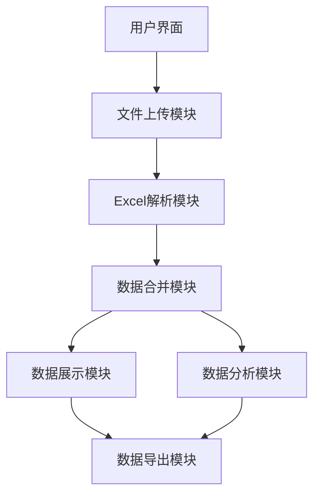

## 1. Architecture Design
纯前端架构，所有数据处理都在浏览器端完成，无需后端服务



## 2. Technology Description
- Frontend: React@18 + TypeScript + tailwindcss@3 + vite
- Initialization Tool: vite-init
- Excel处理: xlsx (SheetJS)
- UI组件: lucide-react 图标库
- 状态管理: zustand
- 无后端服务，纯前端实现

## 3. Route Definitions
| Route | Purpose |
|-------|---------|
| / | 主页面 - 包含所有功能 |

## 4. API Definitions
无后端API，所有功能在前端实现

## 5. Server Architecture Diagram
无后端服务器

## 6. Data Model
无需数据库，数据存储在浏览器内存中

### 6.1 Data Types

```typescript
// Excel文件数据结构
interface ExcelFileData {
  id: string;
  name: string;
  size: number;
  uploadTime: Date;
  sheets: SheetData[];
}

// 单个工作表数据
interface SheetData {
  name: string;
  headers: string[];
  rows: any[];
}

// 合并配置
interface MergeConfig {
  type: 'append' | 'join';
  joinKey?: string;
  selectedSheets: { fileId: string; sheetName: string }[];
}

// 分析结果
interface AnalysisResult {
  columnName: string;
  count: number;
  uniqueCount: number;
  sum?: number;
  avg?: number;
  min?: number;
  max?: number;
}
```
