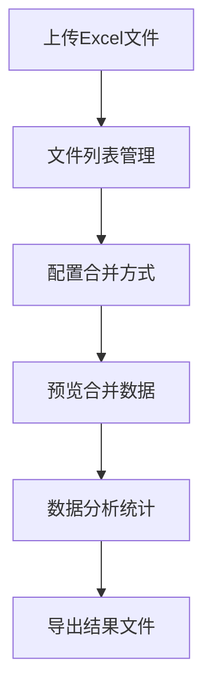

## 1. Product Overview
Excel表格数据分析工具 - 支持单个和多个表格文件的数据合并、分析和导出的Web应用程序
- 解决多表格数据整合难题，为数据工作者提供便捷的分析工具
- 目标用户是需要处理Excel数据的业务人员、分析师等

## 2. Core Features

### 2.1 User Roles
| Role | Registration Method | Core Permissions |
|------|---------------------|------------------|
| Normal User | No login required | 使用所有功能 |

### 2.2 Feature Module
1. **主页面**: 文件上传区域、数据预览、数据合并、数据分析功能
2. **数据预览页面**: 表格数据展示、筛选、排序
3. **导出页面**: 导出合并后的数据为Excel文件

### 2.3 Page Details
| Page Name | Module Name | Feature description |
|-----------|-------------|---------------------|
| 主页面 | 文件上传区域 | 支持拖拽上传和点击上传单个或多个Excel文件(.xlsx, .xls) |
| 主页面 | 文件列表 | 显示已上传文件列表，支持删除操作 |
| 主页面 | 数据合并配置 | 选择合并方式（按列名合并、追加行等），配置合并参数 |
| 主页面 | 数据预览 | 展示合并后的数据表格，支持分页浏览 |
| 主页面 | 数据分析 | 基本统计功能（计数、求和、平均值等） |
| 主页面 | 导出功能 | 导出合并后的数据为Excel文件 |

## 3. Core Process
用户上传一个或多个Excel文件 → 配置合并方式 → 预览合并结果 → 执行数据分析 → 导出结果文件

## 4. User Interface Design
### 4.1 Design Style
- 主色调：蓝色系（#3b82f6），强调数据专业性
- 按钮风格：圆角矩形，悬停有轻微阴影
- 字体：现代无衬线字体，标题使用较粗字重
- 布局风格：卡片式布局，分区清晰
- 图标：使用线性图标，简洁明了

### 4.2 Page Design Overview
| Page Name | Module Name | UI Elements |
|-----------|-------------|-------------|
| 主页面 | 文件上传区域 | 浅蓝色背景，虚线边框，中间有上传图标和文字，拖拽时高亮 |
| 主页面 | 文件列表 | 垂直排列的卡片，每个卡片显示文件名、大小、上传时间，右侧有删除按钮 |
| 主页面 | 数据预览 | 表格样式，表头固定，支持横向和纵向滚动 |
| 主页面 | 操作面板 | 深色背景，白色文字，包含合并配置、分析功能和导出按钮 |

### 4.3 Responsiveness
- 桌面端优先，适配1024px以上屏幕
- 平板端自适应布局，表格可横向滚动
- 移动端简化操作，重点展示文件上传和预览功能

### 4.4 3D Scene Guidance
- 不需要3D场景
